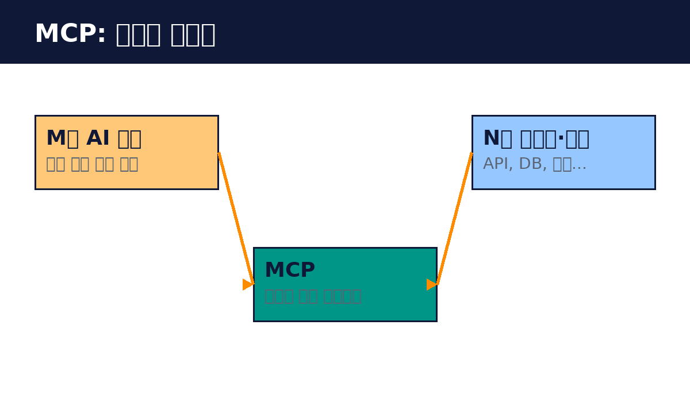

# Part 1. MCP 개요

## 10. MCP란 무엇인가

Model Context Protocol(MCP)은 AI 애플리케이션이 외부 데이터와 도구에 연결되는 방식을 정한 공개 프로토콜입니다. 2024년 11월 Anthropic이 오픈소스로 공개했습니다. 핵심 아이디어는 단순합니다. AI와 도구 사이의 연결을 표준화하면, 한 번 만든 서버를 모든 AI 도구에서 쓸 수 있습니다.

비유를 들어 보겠습니다. USB-C가 나오기 전에는 기기마다 충전 케이블이 달랐습니다. USB-C 이후에는 하나의 케이블로 여러 기기를 충전합니다. MCP 이전의 AI 연동이 기기별 케이블이었다면, MCP는 USB-C입니다. 데이터베이스 연결 MCP 서버를 하나 만들면, Claude Desktop에서도, Claude Code에서도, Cursor에서도 그대로 씁니다.

MCP의 확산 속도는 이례적입니다. 2026년 3월 기준 SDK 월 다운로드가 9700만을 넘었고, 공개된 MCP 서버가 1만 개를 돌파했습니다. Anthropic은 물론 OpenAI, Google, Microsoft, AWS가 채택했습니다. 2025년 12월에는 Linux Foundation 산하 Agentic AI Foundation으로 이관되어 특정 기업에 종속되지 않는 표준이 되었습니다. 기업 AI팀의 78%가 MCP 기반 에이전트를 운영 중이라는 조사도 있습니다.

MCP를 배우는 것은 특정 도구를 배우는 게 아니라 표준을 배우는 것입니다. 표준은 오래 갑니다. 이 책에서 익히는 개념과 실습은 앞으로 나올 AI 도구들에도 그대로 적용됩니다.

핵심 정리
- MCP는 AI와 외부 도구·데이터의 연결을 표준화한 공개 프로토콜이다.
- 한 번 만든 서버를 모든 MCP 클라이언트에서 쓸 수 있다.
- 2026년 현재 업계 표준으로 자리 잡았고 벤더 중립적이다.
