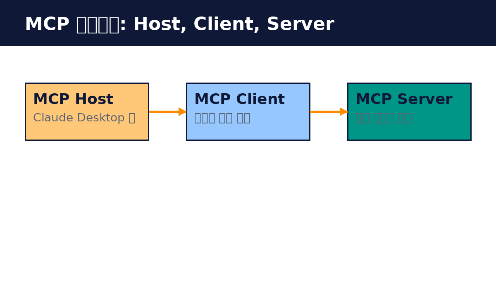

# Part 2. 아키텍처

## 20. Host, Client, Server

MCP는 세 명의 참여자로 구성됩니다.

MCP Host는 사용자가 직접 쓰는 AI 애플리케이션입니다. Claude Desktop, Claude Code, VS Code, Cursor 같은 것들입니다. Host는 여러 MCP 서버와 동시에 연결될 수 있습니다.

MCP Client는 Host 안에서 서버별로 하나씩 만들어지는 연결 담당입니다. 서버가 세 개면 클라이언트도 세 개입니다. 각 클라이언트는 자기 서버와의 연결을 유지하고, 서버에서 컨텍스트를 가져와 Host에게 넘깁니다.

MCP Server는 컨텍스트를 제공하는 프로그램입니다. 데이터베이스 조회, 파일 읽기, API 호출 같은 기능을 제공합니다. 로컬에서 돌 수도 있고, 원격 서버로 돌 수도 있습니다. "서버"라는 이름과 달리, 꼭 네트워크 너머에 있을 필요는 없습니다. 로컬 프로세스로 도는 것도 MCP 서버입니다.

흐름을 정리하면 이렇습니다. 사용자가 Host에게 "지난주 매출을 알려줘"라고 합니다. Host는 연결된 서버들의 도구 목록을 보고 매출 조회 도구가 있는 서버를 찾습니다. 해당 Client가 서버에 도구 실행을 요청합니다. 서버가 실행 결과를 돌려주면, Host가 그 결과를 바탕으로 답을 만듭니다.

중요한 점은 서버가 "무엇을 할 수 있는지"를 선언하고, Host가 "언제 쓸지"를 정한다는 것입니다. 서버는 가능성을 제공하고, 판단은 AI 애플리케이션이 합니다.

핵심 정리
- Host는 AI 앱, Client는 서버별 연결 담당, Server는 컨텍스트 제공자다.
- 서버 하나당 클라이언트 하나가 만들어진다.
- 서버는 기능을 선언하고, 사용할지는 Host가 정한다.
