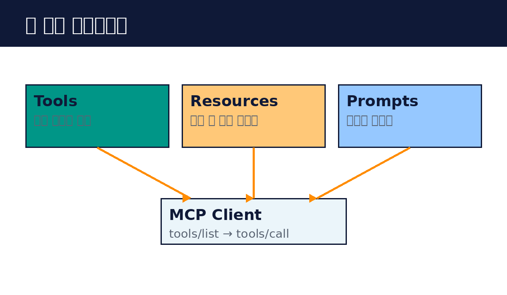

# 22. 세 가지 프리미티브

프리미티브는 MCP 서버가 제공할 수 있는 기능의 종류입니다. 세 가지가 있습니다.

Tools는 실행 가능한 함수입니다. AI가 호출해서 뭔가를 합니다. 파일 쓰기, API 호출, DB 조회 같은 것입니다. 가장 많이 쓰이는 프리미티브입니다. 도구는 이름, 설명, 입력 형식을 선언합니다. AI는 이 선언을 보고 언제 쓸지 판단합니다. 실행은 tools/call로 합니다.

Resources는 읽을 수 있는 데이터입니다. 파일 내용, DB 레코드, API 응답 같은 것입니다. Tools가 "행동"이라면 Resources는 "정보"입니다. AI가 직접 읽어 컨텍스트로 씁니다. 리소스는 URI로 식별됩니다. 예를 들어 file:///docs/guide.md 같은 식입니다.

Prompts는 재사용 가능한 템플릿입니다. 자주 쓰는 지시문을 미리 만들어 둡니다. "이 코드를 리뷰해줘" 같은 프롬프트를 템플릿으로 등록하면, 사용자가 매번 길게 쓰지 않아도 됩니다.

각 프리미티브는 목록 조회와 가져오기로 동작합니다. tools/list로 목록을 보고, tools/call로 실행합니다. resources도 마찬가지 구조입니다. 목록이 동적으로 바뀔 수 있어서, 클라이언트는 필요할 때마다 새로 조회합니다.

서버를 설계할 때는 무엇을 Tools로, 무엇을 Resources로 할지 정합니다. 기준은 단순합니다. 상태를 바꾸는 것은 Tools, 읽기만 하는 것은 Resources입니다. 이 구분이 명확할수록 AI가 잘 씁니다.

핵심 정리
- Tools는 실행, Resources는 정보, Prompts는 템플릿이다.
- 목록 조회와 실행/가져오기의 구조로 동작한다.
- 상태를 바꾸면 Tools, 읽기만 하면 Resources다.
