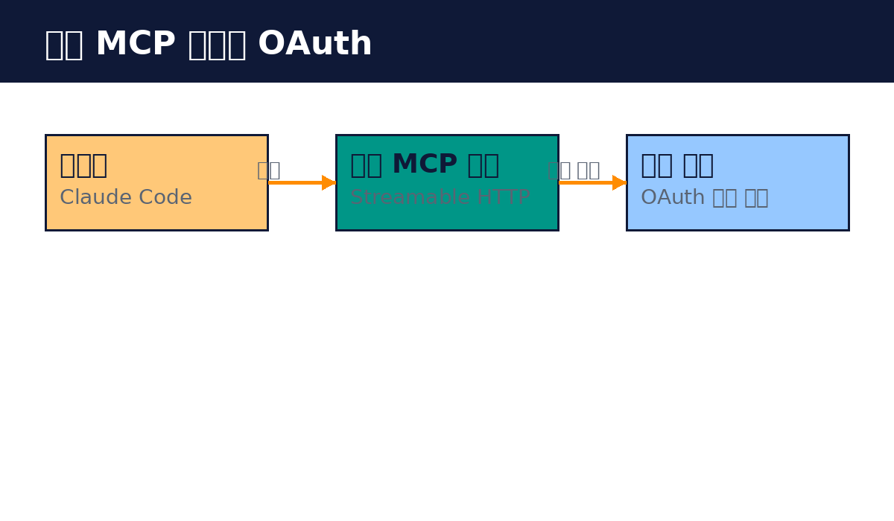

# Part 5. 원격 MCP와 고급 기능

## 50. 원격 MCP 서버 구축

팀이나 조직이 함께 쓰는 서버는 원격으로 만듭니다. Streamable HTTP 전송 방식을 씁니다.

구조는 이렇습니다. HTTP 서버를 띄우고, /mcp 경로에서 MCP 메시지를 받습니다. 클라이언트는 POST로 요청을 보내고, 서버는 응답합니다. 스트리밍이 필요하면 서버가 추가로 보내줍니다. 하나의 서버에 여러 클라이언트가 동시에 붙습니다.

구현할 때의 요령입니다. 프레임워크는 익숙한 것으로 씁니다. TypeScript SDK에는 HTTP 서버 예제가 있습니다. 상태 비저장을 지키는 것이 중요합니다. 각 요청은 독립적으로 처리되어야 합니다. 세션이 필요하면 세션 ID로 관리하고, 서버 재시작에도 견디게 설계합니다.

배포는 컨테이너가 일반적입니다. Docker 이미지로 만들어 두고, HTTPS로 공개합니다. 리버스 프록시를 앞에 두는 구성이 많습니다. 헬스 체크 엔드포인트를 따로 두어 모니터링합니다.

로컬 서버와 다른 점은 동시성과 인증입니다. 여러 사용자가 동시에 쓰니, 요청별로 사용자를 구분해야 합니다. 인증은 다음 장에서 다룹니다. 개발할 때는 로컬 stdio로 만들고, 공유할 때 HTTP로 바꾸는 순서가 수월합니다.

실습: HTTP 서버 띄우기
1. SDK의 HTTP 예제로 서버 실행하기
2. Inspector에 URL로 연결하기
3. 도구 실행해 보기

핵심 정리
- 원격 서버는 Streamable HTTP로 여러 클라이언트를 받는다.
- 상태 비저장을 지키고 세션은 ID로 관리한다.
- HTTPS로 공개하고 헬스 체크를 둔다.
