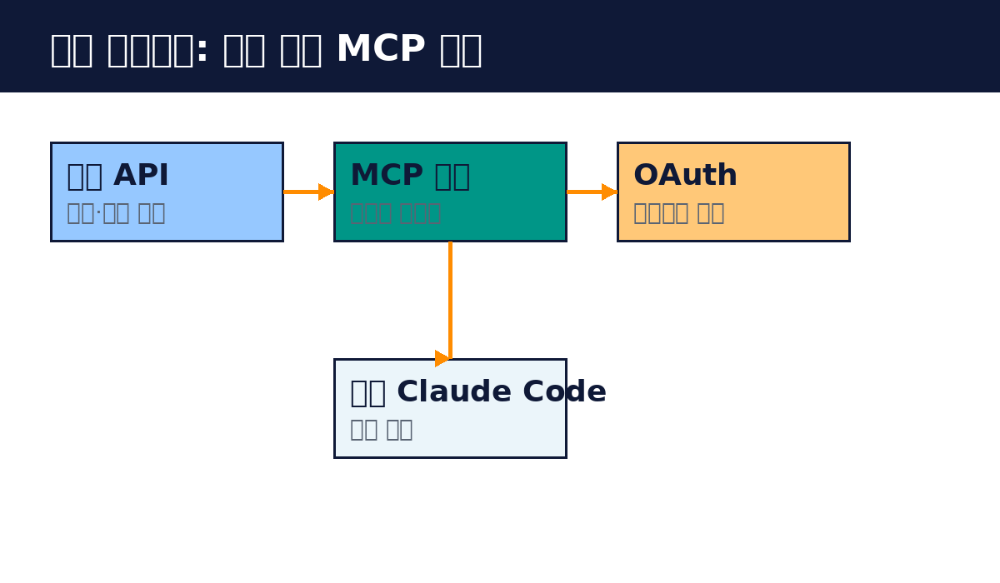

# Part 7. 실전 프로젝트

## 70. 팀용 원격 MCP 서버 구축

지금까지 배운 것을 모아 실전 프로젝트를 합니다. 사내 API를 감싸는 팀용 원격 MCP 서버를 만들고, OAuth로 보호한 뒤 Claude Code와 연동합니다.

프로젝트 목표는 이렇습니다. 팀의 내부 API를 AI 도구에서 쓸 수 있게 합니다. 예를 들어 사내 문서 검색 API, 배포 상태 조회 API 같은 것입니다. 각자 스크립트를 짜는 대신 MCP 서버 하나로 공유합니다.

1단계, API를 감싸는 도구를 만듭니다. 사내 문서 검색 API를 예로 듭니다. 검색어를 입력받아 문서를 돌려주는 도구를 만듭니다. API 키는 환경 변수로 읽습니다. 에러는 이해하기 쉬운 메시지로 바꿉니다.

2단계, HTTP 서버로 만듭니다. Streamable HTTP 전송 방식으로 띄웁니다. 로컬에서 먼저 Inspector로 테스트합니다. 동작이 확인되면 컨테이너로 묶습니다.

3단계, OAuth를 붙입니다. 회사의 인증 서버와 연결합니다. 토큰 검증을 구현하고, 사용자별로 권한을 나눕니다. 읽기 도구는 전 팀원에게, 쓰기 도구는 담당자에게만 엽니다.

4단계, 배포합니다. HTTPS로 공개합니다. 헬스 체크를 둡니다. 로그와 모니터링을 붙입니다.

5단계, Claude Code와 연결합니다. claude mcp add --transport http 로 서버 URL을 등록합니다. 팀원들에게 .mcp.json 설정을 공유합니다. 토큰은 각자 환경 변수로 설정합니다.

6단계, 운영합니다. 도구 사용량을 봅니다. 자주 묻는 질문은 프롬프트 템플릿으로 만듭니다. API가 바뀌면 도구를 업데이트합니다.

이 프로젝트를 마치면 팀의 AI 도구 활용도가 달라집니다. "사내 문서에서 찾아줘" 한 마디로 정보가 나옵니다. 이것이 MCP가 주는 변화입니다.

핵심 정리
- 사내 API를 도구로 감싸 원격 서버로 만든다.
- OAuth로 보호하고 사용자별 권한을 나눈다.
- Claude Code와 연결해 팀 전체가 쓴다.
